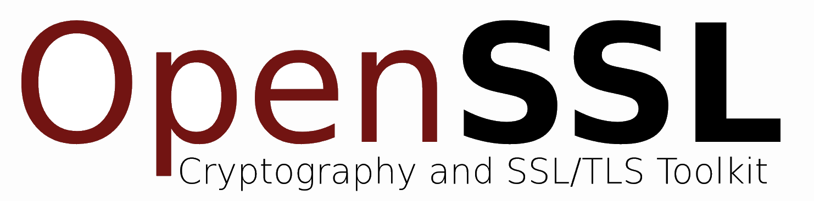

<a href="https://www.openssl.org">
    
</a>

[](https://travis-ci.org/openssl/openssl)
[](https://ci.appveyor.com/project/openssl/openssl/branch/master)
<!--
TODO: the security token for the appveyor badge (the random number in the url above) was obtained for the mspncp/openssl project. It needs to be replaced by the correct token by some core member (@levitte, @mattcaswell?).

It can be obtained for project members at https://ci.appveyor.com/project/openssl/openssl/settings/badges.
-->

# OpenSSL – Cryptography and SSL/TLS Toolkit

OpenSSL is a robust, commercial-grade, and full-featured toolkit for the Transport Layer Security (TLS) and Secure Sockets Layer (SSL) protocols. 

The OpenSSL toolkit includes:

- **libssl**    - client and server-side implementations of the SSL and TLS protocols
- **libcrypto** - general-purpose cryptography library wich provides the basis for libssl, but can also be used standalone
- **openssl**   - the OpenSSL command line tool, a swiss army knife for cryptographic tasks, testing and analyzing.

## Home Page

The official Home Page of the OpenSSL Project is [www.openssl.org](https://www.openssl.org).


## Download

Source code tarballs of the official releases can be downloaded from [www.openssl.org/source](https://www.openssl.org/source). The OpenSSL project does not distribute the toolkit in binary form itself.
www.openssl.org/source
You can obtain a local copy of the git repository by either cloning it from the original OpenSSL repository at [git.openssl.org](https://git.openssl.org)

```bash
    git clone git://git.openssl.org/openssl.git
```

or from this GitHub repository, which is a downstream mirror that is updated automatically on every commit.

```bash
    git clone https://github.com/openssl/openssl.git
```

If you intend to contribute to OpenSSL, either to fix bugs or contribute new features, you should your own clone of the OpenSSL repository. All development of OpenSSL nowadays is done via GitHub pull requests.


## Build and Install

After obtaining the Source, have a look at the [README](../README) and the [INSTALL](../INSTALL) file in its main directory for detailed instructions.

## Documentation

### Manual Pages

The manual pages for the master branch and all current stable releases are available online.

- [OpenSSL master](https://www.openssl.org/docs/manmaster)

- [OpenSSL 1.1.1](https://www.openssl.org/docs/man1.1.1)
- [OpenSSL 1.1.0](https://www.openssl.org/docs/man1.1.0)
- [OpenSSL 1.0.2](https://www.openssl.org/docs/man1.0.2)


## License

See the file [LICENSE](../LICENSE) in the main source directory.

## Support

There are various ways to get in touch. The correct channel depends on your requirement.


### General questions about using OpenSSL

In this case the [openssl-users](https://mta.openssl.org/mailman/listinfo/openssl-users) mailing list is the right place for you. The list is not only watched by the OpenSSL team members, but also by many other OpenSSL users. Here you will most likely get the answer to your questions. An overview over the [mailing lists](#mailing-lists) can be found below.


### Reporting a Bug

Please keep in mind: Just because something doesn't work the way you expect does not mean it is necessarily a bug in OpenSSL. If you are not sure, consider searching the mail archives and posting a question to the [openssl-users](https://mta.openssl.org/mailman/listinfo/openssl-users) mailing list.

#### Open an Issue

If you think you found a bug, please open an [Issue](https://github.com/openssl/openssl/issues) on GitHub. Before opening it, try to enter keywords in the search bar of the issue list to find out whether someone else might have reported your bug already.

Not only errors in the software, also errors in the documentation, in particular the manual pages, can be reported as issues. 

#### Submit a Pull Request

The fastest way to get a bug fixed is to fix it yourself ;-). If you are experienced in programming and know how to fix the bug, you can open a pull request. The details are covered in the [Contributing](#contributing) section.

Don't hesitate to open a pull request, even if it's only a small change like a grammatical or typographical error in the documentation.


## Contributing

If you are interested and willing to contribute regularly to the OpenSSL project, see the [Getting Started](https://www.openssl.org/community/getting-started.html) page on our homepage and the [CONTRIBUTING](../CONTRIBUTING) file in the main source directory for general information.

More specific information and documentation centered on the workflow at GitHub can be found in the [OpenSSL@GitHub Contributors Guide](https://mspncp.github.io).


### Mailing Lists

The OpenSSL maintains a number of [mailing lists](https://www.openssl.org/community/mailinglists.html) for various purposes. The most important lists are:

- [openssl-users](https://mta.openssl.org/mailman/listinfo/openssl-users) for general questions about using the OpenSSL software and discussions between OpenSSL users.

- [openssl-announce](https://mta.openssl.org/mailman/listinfo/openssl-announce) for announcements to the OpenSSL community. Only members of the OpenSSL team can post to it.

- [openssl-project](https://mta.openssl.org/mailman/listinfo/openssl-project) for discussion about the development roadmap and governance.

- [openssl-dev](https://mta.openssl.org/mailman/listinfo/openssl-dev) for discussion about development of OpenSSL.

The openssl-dev list has been discontinued since development is now taking place in form of GitHub pull requests. Although not active anymore, the searchable archive may still contain useful information.
